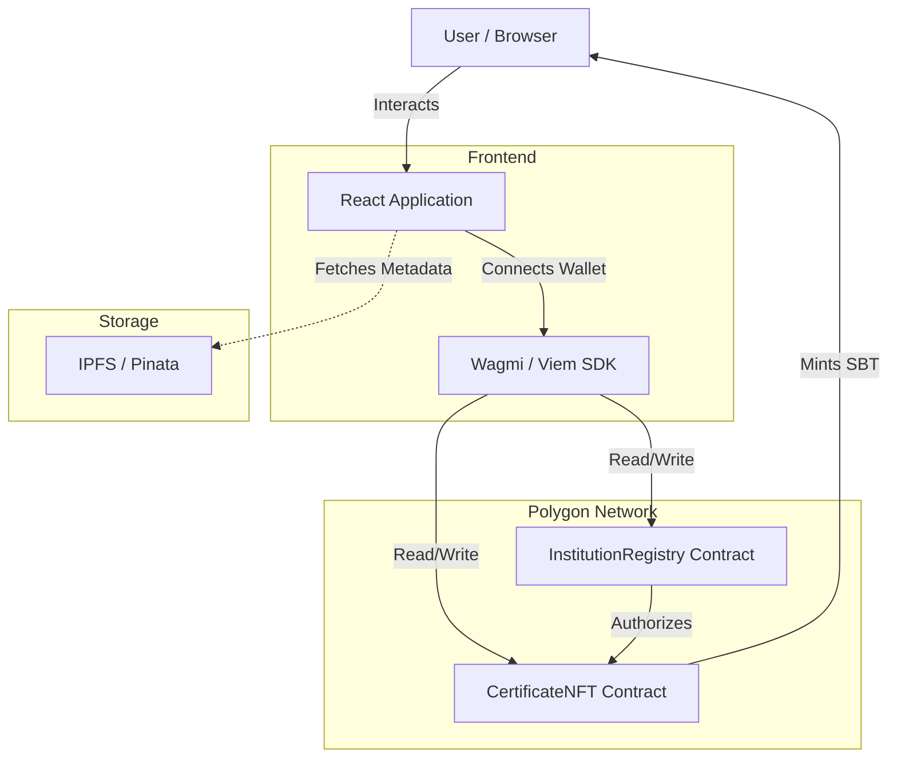

# CertiChain: Decentralized Academic Credential Verification


**CertiChain** is a blockchain-based platform designed to issue, verify, and manage academic certificates and transcripts as **Soulbound Tokens (SBTs)**. By leveraging the Polygon network, CertiChain ensures that academic credentials are tamper-proof, instantly verifiable, and owned permanently by the student.

---

## Table of Contents

- [Overview](#overview)
- [Why CertiChain?](#why-certichain)
- [Key Features](#key-features)
- [Real-World Use Cases](#real-world-use-cases)
- [System Architecture](#system-architecture)
- [Tech Stack](#tech-stack)
- [Smart Contract Design](#smart-contract-design)
- [Getting Started](#getting-started)
- [Usage Guide](#usage-guide)

---

## Overview

Traditional academic verification processes are slow, expensive, and prone to fraud. Paper certificates can be lost or forged, and centralized databases are siloed and vulnerable to downtime or attacks.

CertiChain solves this by tokenizing credentials. When an institution issues a certificate, it is minted as a non-transferable NFT (Soulbound Token) directly to the student's wallet. Employers and third parties can verify these credentials instantly on-chain without needing to contact the issuing university.

---

## Why CertiChain?

### The Problem
1.  **Credential Fraud:** Fake degrees cost the global economy billions and undermine trust in educational institutions.
2.  **Inefficiency:** Background checks often take weeks and require manual communication with registrar offices.
3.  **Lack of Ownership:** Students do not truly own their data; it resides on university servers. If the university closes, the record may be lost.

### The Solution
1.  **Immutability:** Once minted on the blockchain, a certificate cannot be altered or backdated.
2.  **Instant Verification:** Verification is programmatic and instant. No phone calls or emails required.
3.  **Sovereignty:** Students hold their credentials in their own non-custodial wallets.

---

## Key Features

*   **Soulbound Tokens (SBTs):** Certificates are ERC-721 tokens that **cannot be transferred** between wallets, ensuring that a degree cannot be "sold" to another person.
*   **Role-Based Access Control:** Only authorized institutions (whitelisted by the Admin) can issue certificates.
*   **Privacy-Preserving Verification:** Capability to verify credentials using hashed data (Name + Email + Course) without publicly exposing PII (Personally Identifiable Information) on the UI by default.
*   **IPFS Integration:** Metadata (images, detailed transcripts) is stored on IPFS (InterPlanetary File System) for decentralized storage efficiency.
*   **Revocation Mechanism:** Institutions can revoke certificates in cases of academic dishonesty or administrative error.

---

## Real-World Use Cases

1.  **University Degree Issuance:** Large universities issuing thousands of degrees annually.
2.  **Bootcamp Certifications:** Coding bootcamps issuing completion certificates that employers can trust.
3.  **Employee Background Checks:** HR departments verifying a candidate's claims instantly.
4.  **Professional Licensing:** Medical or legal boards issuing licenses that must be publicly verifiable and revocable.

---

## System Architecture

The system consists of a React frontend, two core Smart Contracts on Polygon, and IPFS for metadata storage.



### Data Flow
1.  **Admin** adds an Institution address to the `InstitutionRegistry`.
2.  **Institution** creates metadata (JSON), uploads to **IPFS**, and gets a CID.
3.  **Institution** calls `issueCertificate` on `CertificateNFT`.
4.  **Contract** checks `InstitutionRegistry` for permission.
5.  **Contract** mints Soulbound Token to **Student Wallet**.
6.  **Verifier** queries the blockchain using the Certificate ID or Data Hash.

---

## Tech Stack

### Frontend
*   **Framework:** React 18
*   **Language:** TypeScript
*   **Styling:** Tailwind CSS
*   **Icons:** Lucide React
*   **Build Tool:** Vite

### Blockchain Interaction
*   **Library:** Wagmi & Viem (Modern replacements for Ethers.js)
*   **State Management:** TanStack Query
*   **Wallet Connection:** Injected Connectors (MetaMask, Rainbow, etc.)

### Smart Contracts
*   **Language:** Solidity ^0.8.20
*   **Standard:** ERC-721 (Non-Fungible Token)
*   **Security:** OpenZeppelin Contracts (Ownable, ERC721)
*   **Network:** Polygon Amoy (Testnet) / Polygon PoS (Mainnet)

---

## Smart Contract Design

### 1. InstitutionRegistry.sol
Acts as the gatekeeper.
*   **`registerInstitution(address)`**: Whitelists an address.
*   **`removeInstitution(address)`**: Revokes issuing rights.
*   **`isAuthorized(address)`**: Returns true/false.

### 2. CertificateNFT.sol
The core logic for credentials.
*   **Inherits:** ERC721, Ownable.
*   **Overrides:** `transferFrom` and `safeTransferFrom` revert to ensure **Soulbound** status.
*   **`issueCertificate(...)`**: Mints token. Requires `registry.isAuthorized(msg.sender)`.
*   **`revokeCertificate(...)`**: Invalidates the struct data without burning the token (audit trail).
*   **Hashing:** Stores `keccak256` hashes of sensitive data for privacy checks.

---

## Getting Started

### Prerequisites
*   Node.js (v18+)
*   MetaMask (Browser Extension)
*   Polygon Amoy Testnet MATIC (for gas fees)

### Installation

1.  **Clone the repository**
    ```bash
    git clone https://github.com/yourusername/certichain.git
    cd certichain
    ```

2.  **Install dependencies**
    ```bash
    npm install
    ```

3.  **Configure Environment**
    Create a `.env` file (optional if hardcoding for verified contracts) or update `constants.ts` with your deployed contract addresses.

4.  **Run Development Server**
    ```bash
    npm run dev
    ```

---

## Usage Guide

### 1. Administrator Setup
1.  Connect wallet (must be the deployer of the Registry).
2.  Navigate to the **Admin** tab.
3.  Enter a wallet address to authorize a new Institution (e.g., a University wallet).

### 2. Institution Issuance
1.  Connect the wallet authorized in the previous step.
2.  Navigate to **Institution** tab.
3.  Fill in Student Name, Course, Email, and Student Wallet Address.
4.  Generate/Paste IPFS hash.
5.  Click **Mint Certificate**. Confirm transaction in MetaMask.

### 3. Verification
1.  Navigate to **Verify** tab.
2.  **Mode A (ID):** Enter the Certificate ID (e.g., `1`).
3.  **Mode B (Privacy):** Enter the exact Student Name, Email, Course, and Date. The app generates a hash locally and queries the blockchain for a match.
4.  View the status (Valid/Revoked) and metadata.

---

## Security & Audit

*   **Access Control:** Strictly enforced via `onlyOwner` and `onlyAuthorized` modifiers.
*   **Data Integrity:** Implements `keccak256` hashing for verification data to prevent tampering.
*   **Soulbound Enforcement:** All transfer functions strictly revert.

---

Built on Polygon.
